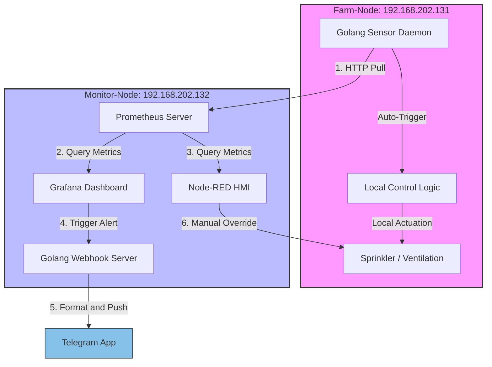

---

```markdown
# 🚜 Agritech Edge Observability Pipeline


A specialized monitoring middleware and resilient telemetry data pipeline built with Go. Designed for resource-constrained agricultural edge environments (Farm-nodes), this project bridges Grafana alerts and automated notification systems for smart farm infrastructure.

## 📸 Dashboard Overview


## 🏗️ Architecture Flow

1. Farm sensors send data to the embedded Time-Series DB (Prometheus/InfluxDB).
2. Grafana monitors thresholds (e.g., Temp > 30°C).
3. Grafana triggers a Webhook to this Go Server.
4. The Go Server processes the logic and notifies via Telegram, while enabling local actuation.

### System Topology



## 🛠️ Middleware Technical Specifications

### Key Features

* **Real-time Alert Processing:** Handles incoming HTTP POST webhooks from Grafana.
* **Dynamic Messaging:** Parses alert payloads to deliver context-aware notifications via Telegram.
* **Automated Response:** Triggers cooling or irrigation system logic based on farm environmental thresholds.
* **Secure Configuration:** Decoupled credentials management using runtime environment variables (Anti-Hardcoding Pattern).

### Tech Stack

* **Language:** Go 1.20+ (Optimized for low-latency & concurrency)
* **Monitoring/Alerting:** Grafana v10 & Prometheus
* **Notification API:** Telegram Bot API
* **Infrastructure:** Linux systemd (Daemonized with auto-recovery)

## 🚀 Key Achievements

* **Extreme Resource Efficiency:** The Go ingestion webhook is optimized to consume less than **3 MiB of Memory** and **0.15% CPU**, proving its suitability for low-powered edge devices.
* **Production-Grade Reliability:** Transitioned from Node-RED to a robust Grafana/Prometheus stack, implementing OS-level process management (systemd) to prevent alerting failures (e.g., resolving 404 Webhook delivery errors).
* **Actionable Insights:** Configured intuitive thresholds (Green/Orange/Red) to prevent alert fatigue and bridge the communication gap between IT infrastructure and agronomy operations.

## ⚙️ Setup Instructions

1. Configure `.env` with your `TELEGRAM_BOT_TOKEN` and `TELEGRAM_CHAT_ID`.
2. Build: `go build -o webhook-server main.go`
3. Run as a service using the provided `systemd` configuration (`Restart=on-failure` enabled).
